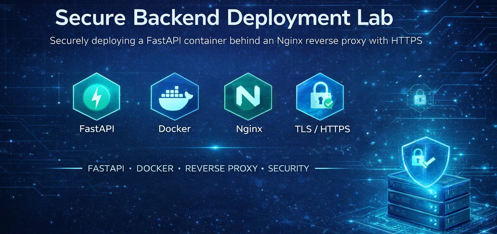
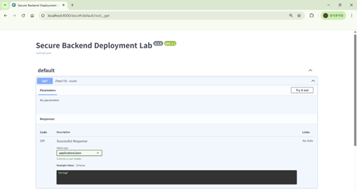
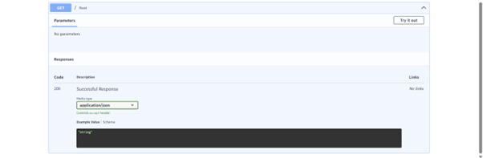
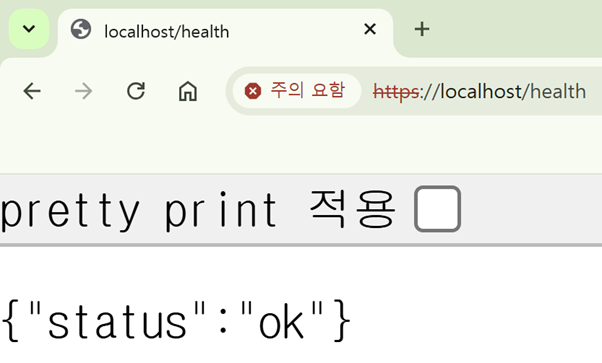
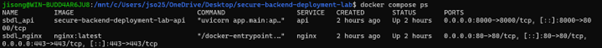

<p align="center">
  
</p>

<h1 align="center">
Secure Backend Deployment Lab
</h1>

<p align="center">
컨테이너 기반 FastAPI · 리버스 프록시 · HTTPS · 보안 하드닝
</p>

<p align="center">
  
  
  
  
  
  
  
</p>

---

# 프로젝트 개요

**Secure Backend Deployment Lab**은  
컨테이너 환경에서 백엔드 서비스를 안전하게 배포하기 위한  
보안 중심 인프라 구축 프로젝트입니다.

FastAPI 애플리케이션을 Docker로 컨테이너화하고  
Nginx 리버스 프록시 뒤에 배치하여 HTTPS 암호화 및  
보안 헤더를 적용한 배포 구조를 구현했습니다.

본 프로젝트는 다음 역량을 포트폴리오로 증명하는 것을 목표로 합니다.

- 백엔드 배포 아키텍처 설계
- 컨테이너 기반 서비스 운영
- 리버스 프록시 구성
- TLS 암호화 적용
- 보안 하드닝 설정

---

# 아키텍처 구조

## ASCII 아키텍처 다이어그램
```
            ┌────────────────────┐
            │       Client       │
            │  Browser / Curl    │
            └─────────┬──────────┘
                      │ HTTPS
                      ▼
            ┌────────────────────┐
            │       Nginx        │
            │    Reverse Proxy   │
            │    TLS Termination │
            │   Security Header  │
            └─────────┬──────────┘
                      │ 내부 네트워크
                      ▼
            ┌────────────────────┐
            │      FastAPI       │
            │   App Container    │
            │   Uvicorn Server   │
            └────────────────────┘
```

---

# 기술 스택

| 구성 레이어 | 사용 기술 |
|------------|-----------|
| Backend | FastAPI |
| WAS | Uvicorn |
| Reverse Proxy | Nginx |
| Container | Docker |
| Orchestration | Docker Compose |
| TLS 인증서 | OpenSSL |
| 개발 환경 | WSL2 Ubuntu |

---

# 배포 흐름

1. FastAPI 애플리케이션 컨테이너 빌드
2. Nginx 리버스 프록시 컨테이너 실행
3. 내부 네트워크 연결
4. TLS 인증서 적용
5. HTTP → HTTPS 리다이렉트
6. 보안 헤더 삽입
7. 외부 포트 개방 (80 / 443)


---

# 보안 적용 요소

본 프로젝트는 실제 서비스 배포 환경을 고려하여  
다음과 같은 보안 설정을 적용했습니다.

---

## 1. TLS 암호화 적용

- OpenSSL 기반 Self-Signed 인증서 생성
- TLS 1.2 / 1.3 활성화
- 클라이언트–서버 구간 암호화
```
ssl_protocols TLSv1.2 TLSv1.3;
```

## 2. HTTP → HTTPS 강제 리다이렉트

모든 평문 요청을 HTTPS로 전환합니다.

```
return 301 https://$host$request_uri;
```


이를 통해:

- 세션 탈취 방지
- 중간자 공격 방지
- 평문 인증정보 노출 차단


## 3. 리버스 프록시 기반 백엔드 보호

직접 접근 구조가 아닌 프록시 경유 구조입니다.

```
Client → Nginx → FastAPI
```


보안 효과:

- 백엔드 IP 은닉
- 직접 공격 차단
- 트래픽 중앙 제어

## 4. 보안 헤더 적용

프록시 레이어에서 보안 헤더 삽입:

| 헤더 | 방어 목적 |
|------|-----------|
| X-Content-Type-Options | MIME 스니핑 방지 |
| X-Frame-Options | 클릭재킹 방지 |
| Referrer-Policy | Referrer 유출 방지 |
| Permissions-Policy | 센서 접근 제한 |
| X-XSS-Protection | XSS 필터링 |

예시 설정:

```
add_header X-Frame-Options "DENY";
add_header Referrer-Policy "no-referrer";
```


---

# 디렉토리 구조

```
secure-backend-deployment-lab/
│
├── backend/
│ ├── app/
│ │ └── main.py
│ ├── Dockerfile
│ └── requirements.txt
│
├── nginx/
│ ├── default.conf
│ └── certs/
│ ├── localhost.crt
│ └── localhost.key
│
├── docker-compose.yml
└── README.md
```


---

# ▶️ 실행 방법

## 1. 컨테이너 빌드 및 실행

```bash
docker compose up --build
```

## 2. 컨테이너 상태 확인
```
docker compose ps
```

## 3. 헬스체크 테스트
```
curl -k https://localhost/health
```

예상 응답:
{"status":"ok"}

---

# API 엔드 포인트
| Method | Endpoint | 설명       |
| ------ | -------- | -------- |
| GET    | /        | 루트 메시지   |
| GET    | /health  | 서버 상태 확인 |

---

<h2>📸 실행 화면</h2>

<h3>Swagger UI</h3>
<p>
  
  
</p>

<h3>HTTPS 통신 테스트</h3>
<p>
  
</p>

<h3>컨테이너 실행 상태</h3>
<p>
  
</p>


---

# 프로젝트 학습 성과

- 컨테이너 기반 백엔드 배포 경험
- 리버스 프록시 트래픽 제어 이해
- TLS 인증서 발급 및 적용
- HTTPS 통신 검증
- 보안 헤더 설정 경험
- 인프라 계층 분리 설계

---

# 향후 확장 계획

- [ ] Let’s Encrypt 인증서 적용
- [ ] CI/CD 자동 배포
- [ ] WAF 연동
- [ ] Rate Limiting 적용
- [ ] JWT 인증 시스템 구축
- [ ] Kubernetes 기반 오케스트레이션

---

# 프로젝트 상태

✔ FastAPI 컨테이너화

✔ Nginx 리버스 프록시 구성

✔ HTTPS 암호화 적용

✔ 보안 헤더 적용

✔ 배포 테스트 완료
